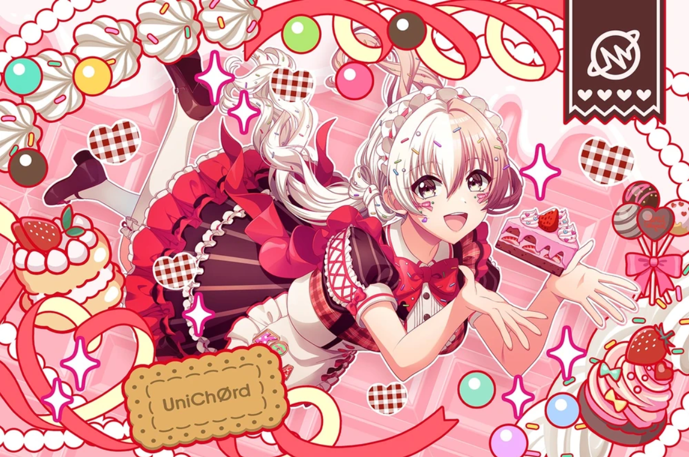
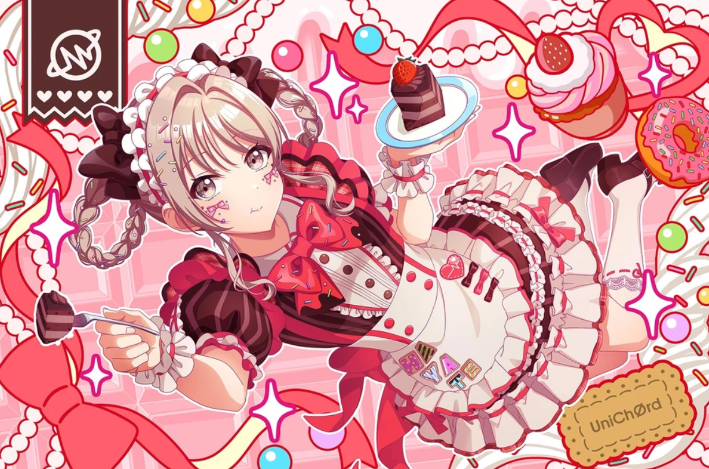

# what is this site?
this is my professional-ish website that's supposed to host my resume and other projects I like showing off. frankly, i'm tired of having to re-download my resume every single time that i want to send it back in, so i've decided it's easier to simply host it here on a random page. i didn't take cse11 for nothing!

# who's this random anime girl that's plastered all over your stuff?

this is a poor quality image of Kokoa Shinomiya (四ノ宮 心愛) my favorite anime girl ever! she's a canon lesbian in a relationship with her girlfriend, Hayate Tendo (see below)

the fact that they're together means a lot to me, so that's why i preach about them all the time :)
it's so very important that we have real queer girls in media as male-focused and as, honestly, *bad* as D4DJ and the other anime-idol franchises. but that's besides the point I could write a whole thing on them...

# why are you doing this as a religion-psychology double major? isn't this useless to either of those fields?

yeah, this IS lowkey useless. in an age where AI dominates everything, who gafs about a dinky little website that some random person made? ultimately, it's a bit conceited that i would ever think that anyone would want to see my resume on a website as bad as this. but, i'm being so deadgyatt when i say this: i don't care and it's easier for me this way. if you find value in this website, then good for you! if not, well...it still gave me value, so!!!

# what are your hobbies?

oh god, a litany of things! music (piano, guitar), math (conceptually), studying religion, studying psychology --- studying <i>people</i>, really --- flags... TL;DR --- all my hobbies are unprofitable and i'm going to die poor.

[secret link](emuser.md)